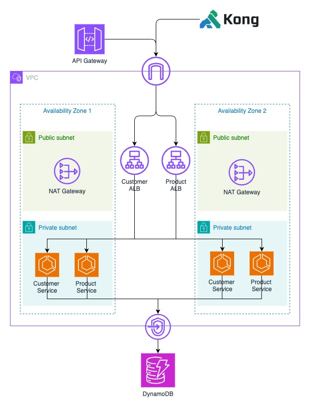
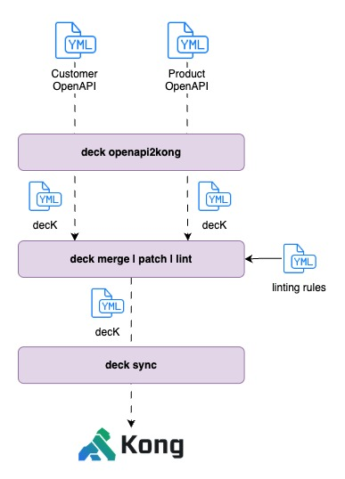

# Federated API Gateway POC ☁️

This project demonstrates an API-first & federated API gateway implementation, where independent teams contribute to a single unified API, using AWS API Gateway and/or Kong Konnect.

OpenAPI specifications are used to build backend services and configure the API gateways.

## Architecture



Note: Public facing components have been chosen for simplicity and cost factors; This does not constitute a production-ready architecture. 
For instance, 
- ALBs would typically be private and connectivity into VPC would be more secure (i.e. IP whitelisting to ensure traffic only originates from gateways).
- Allowing different versions of APIs in different environments (nonprod, prod)

## Project Structure

For simplicity, this project uses a single repository. Ideally, API Gateways would be managed by a dedicated Platform team, while backend services would be handled by separate domain-aligned teams within their own repositories.

```
federated-api-gtw-poc/
├── api-gateway/
│   └── package.json
├── apis/
│   ├── product-api/
│   │   ├── openapi.yaml
│   │   └── package.json
│   ├── customer-api/
│   │   ├── openapi.yaml
│   │   └── package.json
├── base-infra/
│   └── package.json
└── kong/
    ├── consumers/
    ├── plugins/
    ├── scripts/
    ├── linting-rules.json
    └── patches.yaml
```

## Features

- API-first design using OpenAPI specifications
- Multiple Node Express APIs (Product and Customer)
- AWS API Gateway configuration from OpenAPI specs
- CDK for infrastructure as code
- DynamoDB for data storage
- ECS Fargate and ALBs for API implementation
- Independent deployment of APIs and API Gateways
- Kong API Gateway configuration from OpenAPI specs
- Base infrastructure components for shared resources
- Typescript types generation from OpenAPI specs

## Prerequisites

- Node.js (v20 or later)
- AWS CDK CLI
- AWS CLI configured with appropriate credentials
- TypeScript
- Docker
- decK (https://docs.konghq.com/deck/)
- Kong Konnect

## Environment Variables

This project requires a `.env` file in the root directory with the following variables:

```bash
VPC_ID=your-vpc-id
PRODUCT_ALB_DNS=your-product-alb-dns
CUSTOMER_ALB_DNS=your-customer-alb-dns

DECK_PRODUCT_DNS=your-product-alb-dns
DECK_CUSTOMER_DNS=your-customer-alb-dns

KONG_CONTROL_PLANE=your-kong-control-plane
KONG_TOKEN=your-kong-konnect-token
KONG_ADDR=https://us.api.konghq.com
```

Create a `.env` file in the root directory and fill in the appropriate values. Do not commit this file to version control.

## Installation

1. Clone the repository
2. Create and configure the `.env` file as described above
3. Install dependencies:
   ```bash
   npm install
   ```

## Development

1. Build the project:
   ```bash
   npm run build
   ```

2. Deploy the infrastructure:
   ```bash
   npm run deploy:base     # Deploy VPC and subnets

   # Update the `VPC_ID` in the .env file before running next set of commands

   npm run deploy:product  # Deploy only Product API
   npm run deploy:customer # Deploy only Customer API
   
   # Update the `PRODUCT_ALB_DNS` and `CUSTOMER_ALB_DNS` entries in .env file before running next set of commands

   npm run deploy:gateway  # Deploy only API Gateway
   npm run deploy:kong     # Deploy Kong Konnect gateway
   ```

  `npm run deploy:all` can also be run for conveniance once environment variables are populated. 

   Note: The API Gateway deployments will automatically:
   - Generate the combined OpenAPI specs
   - Layer any additional plugins
   - Deploy the API Gateway with the proper configurations

## Publishing API changes

For each backend service, `npm run publish` can be executed to processing the service's OpenAPI specification and making it available to each gateway for deployment.

### Kong



The API publishing functionality uses the script at `kong/scripts/publish-api.sh`. This script will:
1. Validate the required arguments are provided
2. Generate Kong configuration from the OpenAPI spec
3. Apply any Kong-specific patches if provided
4. Apply any Kong plugin configurations if provided
5. Output the final configuration to `kong/apis/kong-{api-name}-config.yaml`
6. Lints the configuration against a centrally defined set of rules

Usage:
```bash
./kong/scripts/publish-api.sh --name <api-name> --spec <openapi-file> --patches <patches-file> --plugins <plugins-file>
```

Once the service configuration is staged, the Kong gateway can be deployed using `kong/scripts/deploy.sh`. This script will:
1. Merges all API config files (*.yaml) from the `kong/apis/` directory into a single file
2. Merges the combined API configs with platform base templates
3. Applies any patches defined in patches.yaml
4. Previews changes that would be made to Kong
5. Syncs the final configuration to Kong Gateway (unless --preview is specified)

Usage:
```bash
./kong/scripts/deploy.sh [--preview]
```

### AWS API Gateway

The API publishing functionality uses the script at `api-gateway/scripts/publish-api.sh`. This script will:
1. Validate the required arguments are provided
2. Copy the OpenAPI file to the output directory
3. Output the final configuration to `apis/api-{api-name}-config.yaml`

Usage:
```
./api-gateway/scripts/publish-api.sh --name <api-name> --spec <openapi-file>
```

Once the service configuration is staged, the AWS API gateway can be deployed using `cd api-gateway && npm run deploy`. This script will:
1. Merges all API config files (*.yaml) from the `apis/` directory into a single file
2. Deploy the API gateway using `cdk deploy`

## API Endpoints

### Product API
- GET `/products` - List all products
- POST `/products` - Create a new product

### Customer API
- GET `/customers` - List all customers
- POST `/customers` - Create a new customer

## License

MIT 